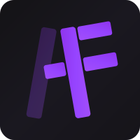
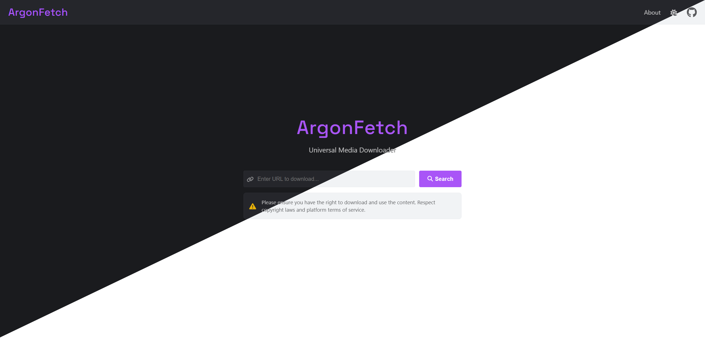

# <p align="center">ArgonFetch</p>
<p align="center">
  
</p>
<p align="center">
  <strong>ArgonFetch is Yet Another Media Downloader.</strong>
  A powerful tool for downloading videos, music, and other media from various online sources.
</p>
<p align="center">
  <a href="https://github.com/ArgonFetch/ArgonFetch"></a>
  <a href="https://www.argonfetch.dev/"></a>
  <a href="https://github.com/ArgonFetch/ArgonFetch?tab=readme-ov-file#-installation"></a>
  <a href="https://github.com/ArgonFetch/ArgonFetch/blob/main/devenv.md"></a>
</p>

---

> **⚠️ Important Note:** This project is currently under development and may not function as described directly from the main branch. For a working version, please check the [Releases tab](https://github.com/ArgonFetch/ArgonFetch/releases) for the latest stable release.

## ✨ Features

- Download from Spotify, YouTube, and more
- Multiple formats: MP3, MP4, WebM
- Docker ready
- Web interface and API

## 📸 Screenshots



## 🐳 Docker Setup

1. **Create a compose.yml file:**

```yaml
services:
  postgres:
    image: postgres:15
    container_name: argonfetch-db
    env_file: .env
    volumes:
      - postgres_data:/var/lib/postgresql/data
    ports:
      - "5432:5432"
    restart: unless-stopped

  argonfetch:
    image: ghcr.io/argonfetch/argonfetch:latest
    # Alternative: docker.io/pianonic/argonfetch:latest
    container_name: argonfetch
    env_file: .env
    environment:
      ConnectionStrings__ArgonFetchDatabase: "Host=postgres;Port=5432;Database=${POSTGRES_DB};Username=${POSTGRES_USER};Password=${POSTGRES_PASSWORD}"
    ports:
      - "8080:8080"
    depends_on:
      - postgres
    restart: unless-stopped

volumes:
  postgres_data:
```

2. **Create a .env file:**

```env
# Database
POSTGRES_USER=argonfetch
POSTGRES_PASSWORD=changeme123
POSTGRES_DB=argonfetch

# Spotify API (Required)
Spotify__ClientId=your_spotify_client_id
Spotify__ClientSecret=your_spotify_client_secret

# CORS Configuration (Required for production)
# Comma-separated list of allowed origins
CORS_ALLOWED_ORIGINS=https://app.argonfetch.dev,https://argonfetch.dev,http://localhost:4200
```

3. **Start it:**

```bash
docker compose up -d
```

The application will be available at `http://localhost:8080`.

Get Spotify credentials from [Spotify Developer Dashboard](https://developer.spotify.com/documentation/web-api/concepts/apps).


## 🛠️ Usage

1. Navigate to `http://localhost:8080`
2. Paste a media URL
3. Download

API docs: `http://localhost:8080/swagger`

## 📋 Roadmap

- [x] Spotify Songs
- [ ] Spotify Playlists
- [ ] Spotify Albums
- [x] YouTube Media
- [ ] SoundCloud Media

### Future Plans
- [ ] Social Media Support (X, Instagram, TikTok ...)

## 💻 Development

See [Development Guide](devenv.md).


## 📜 License

This project is licensed under the GPL-3.0 License. See [LICENSE](LICENSE) for details.

---

**Made with ❤️ by [PianoNic](https://github.com/Pianonic) and [MyDrift](https://github.com/MyDrift-user)**